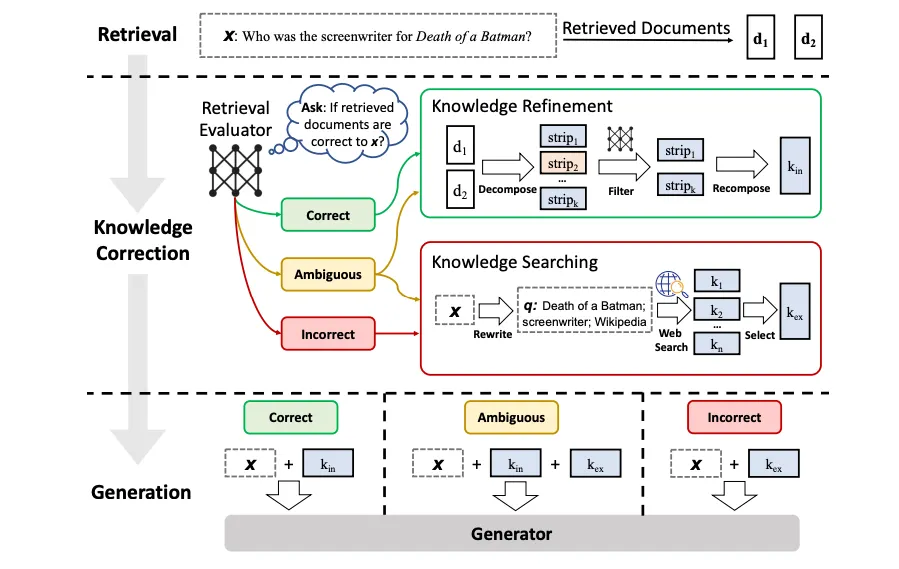

# Self-Correcting CRAG System

[](https://deepwiki.com/Vishwajeet3007/Projects/tree/main/CRAG)

This repository implements a Corrective Retrieval-Augmented Generation (CRAG) system designed to provide accurate, reliable, and citation-grounded answers based on a user-provided set of PDF documents. The system uses a sophisticated pipeline built with LangGraph to self-correct and enhance the quality of retrieved information before generation. When local document knowledge is insufficient, it conditionally performs web searches to find the correct information.



## Features

-   **PDF Document Ingestion**: Upload PDF files, which are automatically parsed, chunked, and indexed into a FAISS vector store for efficient retrieval.
-   **Multi-Query Expansion**: To improve retrieval recall, the initial user question is reformulated into several semantically different queries.
-   **Retrieval & Relevance Evaluation**: The system retrieves document chunks for all query variants and uses an LLM to score the relevance of each chunk to the original question.
-   **Conditional Web Search (Self-Correction)**: Based on the relevance scores, the system follows one of three paths:
    -   **Correct**: Uses the retrieved local documents.
    -   **Ambiguous**: Supplements local documents with information from a targeted web search via Tavily.
    -   **Incorrect**: Discards the local documents and relies solely on web search results.
-   **Reflection & Verification**: After generating an answer, the system reflects on its output by verifying if the answer is fully supported by the context provided.
-   **Citation Generation**: Extracts key sentences from the source context that support the generated answer.
-   **Confidence Scoring**: An LLM estimates a confidence score for the final answer.
-   **Cost Awareness**: Tracks the token usage for each query and flags high-cost operations.
-   **Interactive UI**: A Streamlit-based web interface allows for easy document upload and interaction with the Q&A system.

## Tech Stack

-   **Backend**: Python, LangChain, LangGraph
-   **LLMs**: OpenAI (gpt-4o-mini)
-   **Embeddings**: OpenAI (text-embedding-3-large)
-   **Web Search**: Tavily Search
-   **Vector Store**: FAISS (Facebook AI Similarity Search)
-   **Frontend**: Streamlit

## Architecture Flow

The system operates as a state machine orchestrated by LangGraph:

1.  **Expand**: The initial question is expanded into multiple related queries.
2.  **Retrieve**: Documents are retrieved from the FAISS vector store for all queries.
3.  **Evaluate**: An LLM evaluates the relevance of each retrieved document.
4.  **Route**: Based on the evaluation verdict (`CORRECT`, `AMBIGUOUS`, `INCORRECT`), the graph decides whether to proceed with the current documents or perform a web search.
5.  **Rewrite (Optional)**: If a web search is needed, the original question is rewritten into an optimal web query.
6.  **Web Search (Optional)**: Tavily API is called to fetch relevant web content.
7.  **Refine**: The context is constructed from the best available documents (local, web, or a combination).
8.  **Generate**: An answer is generated based on the refined context.
9.  **Verify**: The answer is checked for factual consistency against the context.
10. **Cite & Score**: Citations are extracted and a final confidence score is calculated.

## Setup and Usage

### Prerequisites

-   Python 3.8+
-   An OpenAI API key
-   A Tavily AI API key

### Installation

1.  **Clone the repository:**
    ```bash
    git clone https://github.com/vishwajeet3007/Projects.git
    cd Projects/CRAG
    ```

2.  **Create and activate a virtual environment (recommended):**
    ```bash
    python -m venv venv
    source venv/bin/activate  # On Windows, use `venv\Scripts\activate`
    ```

3.  **Install the dependencies:**
    ```bash
    pip install -r requirements.txt
    ```

4.  **Set up environment variables:**
    Create a file named `.env` in the `CRAG` directory and add your API keys:
    ```
    OPENAI_API_KEY="your-openai-api-key"
    TAVILY_API_KEY="your-tavily-api-key"
    ```

### Running the Application

1.  **Launch the Streamlit app:**
    ```bash
    streamlit run frontend.py
    ```

2.  **Use the application:**
    -   The application will open in your web browser.
    -   Use the sidebar to upload one or more PDF documents. The system will automatically index them.
    -   Once the "Documents Ready" status appears, you can enter your question in the main area and click "Run CRAG Pipeline".
    -   The results, including the answer, confidence score, and internal analysis, will be displayed in tabs.