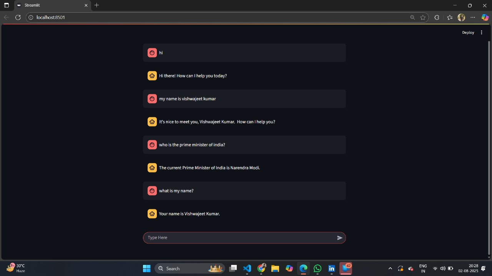

# 💬 LangGraph + Gemini AI Chatbot (Streamlit)

This project is a simple **chatbot** built using [LangGraph](https://github.com/langchain-ai/langgraph), Google's **Gemini AI**, and **Streamlit**. It demonstrates a lightweight conversational app using **state graphs** to manage messages and memory, powered by **LangChain** and Gemini’s `langchain-google-genai` integration.

---

## 🚀 Features

- 🔁 **Stateful chat flow** using LangGraph
- 🤖 **LLM-powered responses** with Gemini 1.5 Flash/Pro
- 📦 **In-memory checkpointing** (for simplicity)
- 🧠 **LangChain-compatible** message handling
- 🖥️ **Streamlit frontend** with persistent conversation history
- 🎯 **Modular code structure** (clean separation of backend and frontend)

---

## 📸 Chatbot Demo

Here’s a quick preview of the working chatbot UI:

<p align="center">
  
</p>

---

## 🗂️ Project Structure

```bash
ChatBot_In_LangGraph/
├── .env                  # API keys and environment variables
├── backend.py            # LangGraph state machine + Gemini config
├── streamlit_frontend.py # Streamlit UI code
├── requirements.txt      # Project dependencies
├── ChatBot_OUTPUT.jpg    # Output screenshot (demo)
└── README.md             # Project overview
🧠 How It Works
💬 User inputs a message via Streamlit chat UI

🛠 Message is passed to the LangGraph state machine

🌐 Gemini 1.5 Flash generates a response

📤 Response is streamed back and rendered live in the UI

🔁 Conversation is preserved using st.session_state

